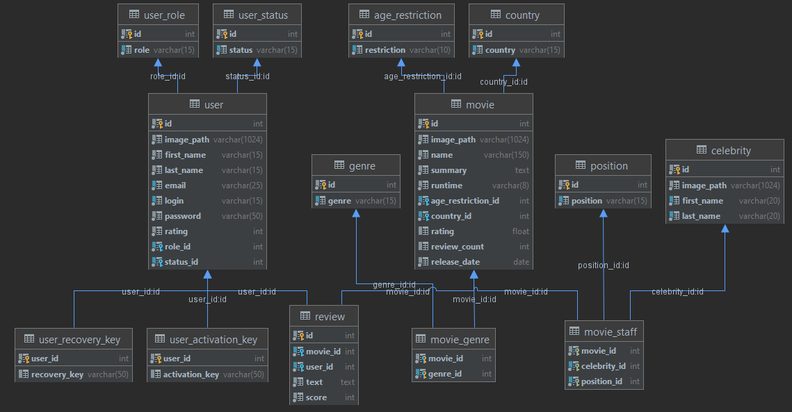

# Epam critics project

## Project concept

User creates an account, views information about movies, celebrities, other users, writes reviews on movies.
Administrator creates and manages movies, celebrities, banes and unbanes users.

## Application architecture: Model-View-Controller

## Project Features

- Database
    - Dynamic thread-safe connection pool
    - Protection from SQL injection
    - Connection proxy
    - Number of tables : 14
      
- Mail sending using Gmail mail server
- Pagination
- Filters
    - Command access filter
    - Filter for accessing pages
    - Encoding filter
    - Cross-site scripting protection filter
- Localization: EN, RU
- 10 custom tags
- Passwords encryption
- Accompanying user actions with messages
- Validating the information both on client and server
- Used design patterns: Command, Factory, Builder, Proxy, Dao, Transaction, Singleton, MVC

## Common Functionality

- Locale changing
- Viewing all movies
- Viewing all celebrities
- Viewing movie information
- Viewing celebrities information
- Viewing other users information
- Viewing other users reviews

## Guests Functionality

- Signing in
- Registering
- Password recovering through generated mail
- Account activation through generated mail

## Common Authorized Users Functionality

- Profile picture uploading
- Editing profile
- Deleting profile
- Creating reviews
- Editing reviews
- Deleting reviews
- Singing out

## Admin Functionality

- Creating new movies
- Editing movies
- Deleting movies
- Creating new celebrities
- Editing celebrities
- Deleting celebrities
- Banning/unbanning users
- Deleting users reviews
- Viewing all users information

### &copy; Barkan Makariy, 2021